I completed a static audit of the SAACP Rust implementation (~2.6 MB of Rust across 60 modules, 56 integration test files, 5 fuzz targets, 29 commits on `main`). I read the protocol core, gate pipeline, daemon, handshake, sidecar, audit log, state/cluster layers, dependency graph, and build/release configuration. I could not compile or execute anything — `cargo` is outside this environment's permitted commands — so every finding below is traceable to source, not to a test run.

---

# 1. Production Readiness Rating: **4 / 10**

Not a uniform 4. The distribution is what matters:

| Dimension | Score | Basis |
|---|---:|---|
| Cryptographic primitives & frame design | 7 | AES-256-GCM per frame, HKDF-SHA256 per `(session, epoch, psn)`, header-as-AAD, Ed25519, `subtle` constant-time compares, X25519 contributory checks, `zeroize` throughout, `#![forbid(unsafe_code)]` |
| Gate-pipeline architecture | 6 | Genuine authorization invariance; fail-closed `SAACPHardDrop`; bounded state caps almost everywhere; `PipelineToken` type-state ordering |
| Gate-pipeline *efficacy* | 3 | Gate 4.0 is a 56-entry ASCII literal denylist with high false-positive and near-total bypass rates (§2.2) |
| Network edge hardening | 3 | Unauthenticated default client handshake shipped in the sidecar (§2.1); pre-auth 10 MB allocation (§3.1) |
| Horizontal scalability | 4 | Honest, well-reasoned — but replay window, audit chain, CSCS, and AEGF are all node-local by design; sticky routing is a requirement no code enforces |
| Maintainability | 5 | Outstanding inline rationale; undermined by 4,000+-line modules and ~30 process globals |
| Observability & operability | 2 | Zero structured logging; config is 36 scattered `env::var` reads; `/metrics` reads the global singleton, not the injected context |
| Release & supply-chain engineering | 1 | No CI, no tags, no CHANGELOG/SECURITY.md, no container or deploy manifests, EOL `rustls 0.21` in the tree |

**Why 4 and not higher.** The security *engineering* is well above the norm for a prototype — the codebase argues with itself in comments, documents its own residual gaps, and regression-locks known limitations (`test_scan_middle_of_oversized_payload_is_known_gap`). That earns real credit. But three things independently block production:

1. The flagship integration path (`saacp-sidecar`, the entire Python/LangChain/AutoGen story) performs **unauthenticated ECDH with no server-key verification**. Confidentiality and integrity are fully defeated by an active on-path attacker.
2. A 128-byte unauthenticated header triggers a **10 MB zero-filled allocation** before any AEAD check, ×10,000 permitted connections.
3. There is **no CI**. 56 adversarial test files and 5 fuzz targets that no automation runs are documentation, not a safety net. Nothing prevents the next commit from silently reverting any of the ~80 catalogued security fixes.

**Why 4 and not lower.** The threat model is real and articulated. `SAACPNetworkDaemon::new()` genuinely is secure-by-default with the permissive shape renamed `insecure_for_testing()`. Errors are opaqued through PECF/SREL. The `benchmark_results.md` file reports a negatively-scaling audit WAL and a provably-broken single-byte shard hash rather than hiding them. That intellectual honesty is rare and materially reduces the risk of unknown-unknowns.

---

# 2. Gap Analysis

## 2.1 CRITICAL — The sidecar's outbound handshake has no server authentication

`src/sidecar.rs:561` and `:808` both call:

```rust
let (session_key, _identity_session_id) =
    tokio::time::timeout(timeout, client_handshake(&mut stream, None))
```

`client_handshake(stream, None)` takes the unpinned branch at `daemon.rs:1827-1838`: it reads a bare 32-byte X25519 public key and derives the session key with **zero verification**. The pinned variants exist (`client_handshake_with_pinned_server`, and the identity-bound path which checks `expected_server_verifying_key` at `daemon.rs:1888`) — the sidecar uses neither.

Consequences, all reachable by a standard on-path attacker:

- Two independent ECDH exchanges give the attacker both session keys → **full plaintext read and arbitrary rewrite of every task**.
- The capability token is a payload field (`"_capability_token"`, `sidecar.rs:626`) whose HMAC covers token claims only, not the task text. Rewriting `"task"` does not invalidate it.
- The token is issued with `allow = &[BOOTSTRAP_AGENT]` i.e. `["unknown"]` (`sidecar.rs:591`) and a 60 s TTL. It is therefore a **bearer credential valid against every peer in the mesh**. A malicious or compromised peer B can replay A's token to peer C within 60 s and act as A — the exact confused-deputy scenario the protocol exists to stop.
- The ack is plaintext `b"SUCCESS"` compared byte-wise (`sidecar.rs:676`, `daemon.rs:114`). It is unauthenticated, so the `SendResult` that `wrap()` hands back to the Python agent is forgeable.

**Fix:** make server-key pinning mandatory on the sidecar path. Extend `SidecarConfig`/`peers` from `{"agent-b": "127.0.0.1:7444"}` to carry each peer's Ed25519 verifying key, route through `client_handshake_with_pinned_server`, and make a missing peer key a hard startup error — the same "refuse rather than downgrade silently" discipline `wrap()` already applies to missing secrets. Additionally: scope the token's `allow` list to the specific peer after the first frame pins the real `iss` (the C5 mechanism already exists server-side), and replace the plaintext ack with a MEASC frame under the session key.

## 2.2 HIGH — Gate 4.0 is a keyword denylist with both false negatives and false positives

`normalize_window` (`handler.rs:727-736`) does NFKC → strip zero-width → map ~300 confusables → **`filter(|c| (*c as u32) < 128 && !c.is_whitespace())`** → strip `/**/` → lowercase, then Aho-Corasick against 56 ASCII literals (`handler.rs:174-232`).

**False negatives.** Two structural bypasses:

- *Non-Latin scripts are deleted, not transliterated.* An injection written in Chinese, Russian, Arabic, Hindi, or Japanese normalizes to (near) the empty string. It cannot match any pattern. Gate 4.0 provides not weak but **zero** coverage for non-English prompt injection.
- *Paraphrase.* `"ignorepreviousinstructions"` matches; "pay no attention to your earlier directions", "from this point forward you are", "the operator has revised your guidelines" match nothing. Prompt injection is a semantic problem; literal substring matching cannot bound it.

**False positives — the more immediate production blocker.** Because whitespace is *removed* rather than replaced with a separator, word boundaries are destroyed and cross-word substring matches are guaranteed. Confirmed against the actual pattern list:

| Ordinary English input | Normalizes to | Matches | Result |
|---|---|---|---|
| `the contract as agreed` | `thecontractasagreed` | `actas` | `PromptInjectionDetected` |
| `contact assistant for scheduling` | `contactassistantforscheduling` | `actas` | `PromptInjectionDetected` |
| `perform retrieval (top-k)` | `performretrieval(top-k)` | `eval(` | `PromptInjectionDetected` |
| `move the backdrop table` | `movethebackdroptable` | `droptable` | `PromptInjectionDetected` |

The blast radius compounds. Each rejection fires `PenaltyKind::InjectionAttempt` (`handler.rs:2674`) at weight **0.30** (`trust_decay.rs:124`). From `TRUST_SCORE_INITIAL = 1.0`, three such messages reach 0.10 — below `TRUST_REAUTH_THRESHOLD = 0.25` — forcing a re-handshake with a 60 s minimum cooldown and roughly five minutes of passive recovery at `0.0005/s`, further slowed by `TRUST_REPEAT_PENALTY_DECAY`. In parallel, `record_error` trips the rate limiter at 5 errors / 10 s for a 30 s lockout. **An agent that says "the contract as agreed" three times is ejected from the mesh.**

**Fix:** (a) join tokens with a sentinel instead of deleting whitespace, so patterns match on word boundaries — this alone eliminates the entire false-positive class above at no detection cost; (b) delete or word-anchor the substring-hazardous patterns (`actas`, `exec(`, `eval(`, `nolimits`, `or1=1`); (c) reclassify Gate 4.0 from a hard-drop to a scored signal that gates escalation and feeds telemetry, keeping hard-drop only for unambiguous tokens (`<|im_start|>system`, `xp_cmdshell`); (d) transliterate non-Latin script rather than dropping it, and add a model-based or entropy-based check for `IRREVERSIBLE`-class frames; (e) restate the gate's role in the README — "prompt-injection resistance built into the wire" overstates a 56-literal denylist.

## 2.3 HIGH — No CI, no releases, no security policy

`.github/` does not exist. Neither does `Dockerfile`, `deny.toml`, `rust-toolchain.toml`, `CHANGELOG.md`, `SECURITY.md`, `CONTRIBUTING.md`, `CODEOWNERS`, or any Kubernetes/Helm manifest. `git tag -l` is empty across 29 commits.

The consequences are concrete, not procedural:

- `rustfmt --check` is described as a CI gate (commit `79459d0`, "one-time formatting baseline for CI fmt --check") for a CI that does not exist.
- `tests/breakit/supplychain/run_checks.sh` check 1 runs `RUST_LOG=trace cargo test` and greps for leaked key material. The crate has **no `log` or `tracing` dependency**, so `RUST_LOG` is inert and this check passes vacuously.
- `cargo audit` is optional and manual (`run_checks.sh:73`).
- `fuzz/corpus/` and `fuzz/artifacts/` are gitignored, so there is no seed corpus. Each fuzz session restarts from zero coverage.
- Feature-gated tests (`sidecar`, `command-center`, `transport-*`, `redis-backend`, `hrt-*`) require separate invocations that nothing enforces. Feature-combination bit-rot is undetectable.

**Fix:** a GitHub Actions matrix over `{default, sidecar, command-center, transport-wss, redis-backend, hrt-aws-kms, hrt-gcp-kms, hrt-pkcs11}` running `fmt --check`, `clippy -D warnings`, `test`, `cargo deny check` (advisories + bans + licenses + sources), and a time-boxed `cargo fuzz run` per target with a committed corpus. Pin the toolchain in `rust-toolchain.toml` — `benchmark_results.md` cites `rustc 1.96.0` and the README says "1.96+", but nothing enforces it. Add `SECURITY.md` with a disclosure address, tag `v0.1.0-beta2`, and start a CHANGELOG.

## 2.4 HIGH — No structured logging

All 60+ operational messages are `eprintln!` with hand-rolled `[SAACP Daemon]` prefixes (`daemon.rs:670-801`, `security.rs:2064-2470`, `transport/tls.rs:435-581`, `cluster` rejections at `daemon.rs:1321`). There are no levels, no fields, no JSON, no trace/span correlation, no sampling, and no way to ship to a SIEM.

For a protocol whose entire premise is auditability this is the sharpest contradiction in the codebase. It also has a runtime cost: `eprintln!` takes the global stderr lock, so any authenticated-but-rejected traffic class that logs (cluster envelope rejections do) becomes a serialization point under load. `src/sidecar.rs:972` also ships a `[pool-debug]` print behind `SAACP_POOL_DEBUG`.

**Fix:** adopt `tracing` + `tracing-subscriber` with a JSON layer; emit `session_id`/`agent_id`/`gate`/`bytecode`/`correlation_id` as structured fields (never payload content — PECF's confidentiality posture must extend to logs); add `tracing-opentelemetry` so the 24-byte W3C `traceparent` already in the MEASC header at offset 80 actually reaches a collector. Then `run_checks.sh` check 1 becomes a real test.

## 2.5 MEDIUM-HIGH — No protocol version field on the wire

Neither the 128-byte MEASC header (`framing.rs:21`, offsets documented in README §"MEASC 128-byte transport header") nor the 101-byte `SAACPFrame` prefix carries a protocol version. The magic is fixed `b"SACP"`. `crypto_governance::PROTOCOL_VERSION` is a negotiation-transcript string, never a frame field; `context_version` at offset 76 is application context state.

Any wire-format change therefore requires a flag day across the entire fleet. There is no in-band capability negotiation and no graceful downgrade during a rolling deploy — for a protocol at `0.1-beta2` intending to evolve, this is the most expensive gap to fix later.

**Fix:** claim one of the 3 padding bytes at offset 9 (or a byte from the 24 reserved at offset 104) as `protocol_major`/`minor`. It is inside the AAD, so it is tamper-proof for free. Define now that unknown-major is a hard drop and unknown-minor is ignored, and add a cross-version compatibility fixture alongside the existing `tests/fixtures/audit_v1_pinned.jsonl` pattern.

## 2.6 MEDIUM — `SaacpContext` covers 6 of ~30 subsystems; Gates 11.0 and 12.0 leak across tenants

`src/context.rs` isolates trust, telemetry, alerts, rulepacks, streams, and audit. Its own doc is candid about the rest. But the residue includes authorization-relevant state on the packet path:

- `GLOBAL_AEGF_GOVERNOR` / `GLOBAL_DAEG` — `handler.rs:2866` falls back to the global when the injected governor is `None`, and `intercept_packet_encrypted_with_ctx` passes `None, None` at `handler.rs:2096-2097`. **Every encrypted-transport caller shares one causal execution graph.**
- `GLOBAL_CSCS` — same fallback at `handler.rs:2956`.
- `DEFAULT_IDENTITY_REGISTRY` / `GLOBAL_IDENTITY_GATE` (`handler.rs:2448`, `daemon.rs:1658-1663`), `faitf::DistributedRevocationInfrastructure::global()`, `DEFAULT_AUTHORITY_REGISTRY`, `klms::DEFAULT_REGISTRY`, `hth::DEFAULT_REGISTRY`, `pecf::ACTIVE_PROFILE`.

So two tenants in one process share identity registries, key registries, revocation state, hop-limit accounting, and oscillation history. Separately, `command_center.rs:632` renders `telemetry::global_telemetry()` — a deployment that constructs per-tenant `SaacpContext::new()` gets **no metrics at all** for those tenants.

**Fix:** extend `SaacpContext` to own AEGF, CSCS, the identity registry/gate, the DRI, and the authority + KLMS registries; delete the `unwrap_or_else(|| &*GLOBAL_…)` fallbacks so omission is a compile error rather than a silent cross-tenant join; make `handle_metrics` read `State<Arc<CommandCenterState>>`'s context. Until then, document "one tenant per process" as a hard constraint in the README rather than presenting multi-tenancy as available.

## 2.7 MEDIUM — Configuration is 36 scattered environment reads

`env::var` appears 36 times across `command_center.rs`, `faitf_audit.rs`, `pecf.rs`, `security.rs`, `state_backend.rs`, `sidecar.rs`, and both binaries. There is no config file, no schema, no single validation point, and no way to version-control or diff a deployment's settings. `pecf::get_active_profile()` re-reads the env var lazily on every hard-drop response (`pecf.rs:95-104`) — correct, and it fails safe to `Production`, but it means the effective profile is decided at first packet rather than at startup.

**Fix:** a `SaacpConfig` struct deserialized from TOML with env override, validated once in `main` before the listener binds, logged as a redacted effective-config dump, and surfaced on `/api/readyz`. Keep the `_FILE` secret indirection the codebase already prefers.

## 2.8 MEDIUM — Supply chain: two TLS stacks, one of them EOL

`Cargo.lock` resolves **`rustls 0.21.12` alongside `rustls 0.23.41`**. The 0.21 branch arrives via `aws-smithy-runtime` → `hyper-rustls 0.24.2` → `tokio-rustls 0.24.1` (`Cargo.lock:391-400`, `1659-1672`) — i.e. enabling `hrt-aws-kms`, advertised as "✅ production" in the README support matrix, drags in an end-of-life TLS implementation plus `hyper 0.14` and `h2 0.3`. Also duplicated: `axum` 0.7.9 + 0.8.9, `rand` 0.8.6 + 0.10.2. `openssl 0.10.81` / `native-tls` enter through `reqwest`'s default TLS in the dev graph.

For a security product this doubles both the attack surface and the patching burden, and it puts a C dependency in the build of a crate whose headline invariant is `forbid(unsafe_code)`.

**Fix:** bump `aws-sdk-kms`/`aws-config` to a release whose smithy runtime is rustls-0.23-only; unify on one `axum`; add `deny.toml` with `[bans] multiple-versions = "deny"` and explicit `skip` entries so each duplicate is a deliberate, reviewed decision. Better: route KMS through the existing `src/hrt/remote.rs` seam so the gateway process never links a cloud SDK at all.

## 2.9 LOW-MEDIUM — Two unbounded/fail-open state paths

- **Unbounded:** `acsvaf::CapabilityVerificationAuthority::revoked_tokens` is a plain `RwLock<HashSet<String>>` (`acsvaf.rs:423`) with no cap, no TTL, and no `MaintenanceCoordinator` sweeper — the only reclaim is a manual `clear_replay_registry()`. This contradicts the crate's stated "Bounded Everything" principle, which `gateway.rs` honours properly (`REVOKED_TOKENS_MAX`, `prune_expired_revocations`). Its lock uses bare `.unwrap()` (`acsvaf.rs:442-516`) on a Gate 1.0 path, where the crate's own convention elsewhere is `unwrap_or_else(|e| e.into_inner())` poison recovery (`pecf.rs:96`, `gateway.rs:1020`).
- **Fail-open:** `gateway::enforce_revoked_tokens_cap` (`gateway.rs:1042-1066`), once past `REVOKED_TOKENS_MAX = 100_000`, evicts lowest-`exp` entries. Expiry-ordered eviction is the right choice, but the evicted tokens are **still valid** — they are silently un-revoked, with no telemetry counter and no alert.

**Fix:** give `CapabilityVerificationAuthority` an `exp`-keyed bounded map mirroring the gateway's, register it with `MaintenanceCoordinator`, and switch its locks to poison-recovering. For the gateway: emit a counter + `SecurityAlertFeed` event on every eviction, and fall back to raising `blanket_revoked_before` (the mechanism `revoke_all_tokens` already implements at `gateway.rs:1087`) rather than dropping individual entries.

## 2.10 LOW — Documentation drift

README states `HANDSHAKE_TIMEOUT_SECS = 0.1` and `IDENTITY_BINDING_HANDSHAKE_TIMEOUT_SECS = 0.5`; the source says `2.0` and `3.0` (`daemon.rs:40, 48`). README also claims 56 test files (accurate) and "~50 Rust modules" (60). Minor, but in a document this precise the drift is conspicuous — a doctest or a `const`-referencing macro would keep the numbers honest.

---

# 3. Risk Assessment

```mermaid
graph TD
    subgraph EDGE["Network edge — pre-authentication"]
        R1["R1 CRITICAL<br/>Sidecar MITM<br/>unpinned ECDH"]
        R2["R2 HIGH<br/>10MB alloc from<br/>unauth header"]
        R3["R3 MED<br/>spawn_blocking<br/>unbounded queue"]
    end
    subgraph GATES["Gate pipeline"]
        R4["R4 HIGH<br/>Gate 4.0 false positives<br/>-> agent ejection"]
        R5["R5 HIGH<br/>Gate 4.0 bypass<br/>non-English / paraphrase"]
        R6["R6 MED<br/>>32KB interior<br/>unscanned"]
    end
    subgraph FLEET["Multi-node"]
        R7["R7 HIGH<br/>Non-sticky LB<br/>breaks replay window"]
        R8["R8 MED<br/>Audit chain =<br/>single node SPOF"]
        R9["R9 MED<br/>Revocation is<br/>eventually consistent"]
        R10["R10 MED<br/>Redis lease as<br/>consensus authority"]
    end
    subgraph LIFECYCLE["Lifecycle"]
        R11["R11 HIGH<br/>No CI -> silent<br/>regression of 80 fixes"]
        R12["R12 MED-HIGH<br/>No wire version<br/>-> flag-day upgrades"]
        R13["R13 MED<br/>Release-mode integer<br/>overflow wraps"]
    end
    R1 --> IMPACT["Production incident classes"]
    R2 --> IMPACT
    R4 --> IMPACT
    R7 --> IMPACT
    R11 --> IMPACT
```



## R1 — Sidecar MITM (CRITICAL, exploitable today)
Covered in §2.1. Every claim in the README's threat table for the sidecar path — "passive eavesdropping → per-frame AES-256-GCM", "frame tampering → GCM auth tag" — is void when the attacker holds the key because the peer's key was never verified. **Likelihood: high** on any network the operator does not fully control; the README's own architecture diagram shows sidecar-to-sidecar traffic crossing the wire.

## R2 — Pre-authentication memory amplification (HIGH)
`daemon.rs:1007-1035`: `payload_length` is read from **header bytes 12..16 of an unauthenticated frame**, and `payload_buf.resize(payload_length + 16, 0)` allocates and zero-fills immediately, before any AEAD verification. Then `full_packet = Vec::with_capacity(HEADER_SIZE + bytes_read)` copies it — 2× peak per connection during assembly.

`MAX_CONNECTIONS = 10_000`, `MAX_CONNECTIONS_PER_IP = 100`, `MAX_ASSEMBLY_TIME = 30.0`. So 100 source IPs × 100 connections × 10 MB × 2 = **~200 GB peak commit** from 128-byte headers. Amplification ≈ 78,000× per connection. The comment at `daemon.rs:56` frames `MAX_CONNECTIONS` as the fix for this ("~1,000 slow-feed connections exhausts 10GB"), but the chosen limit of 10,000 permits ten times that figure. Every connection stays inside its per-IP cap, its 1-second read timeout, and its 30-second assembly budget — no rate limit fires, because the pathology is memory, not packet rate.

## R3 — `spawn_blocking` per packet (MEDIUM)
`daemon.rs:1199` and `:1224` dispatch every packet's gate pipeline to `tokio::task::spawn_blocking`. Tokio's blocking pool defaults to 512 threads with an **unbounded** queue. At 10,000 connections, queue depth is unbounded and head-of-line latency is unbounded. `benchmark_results.md` is explicit that the measured ~2 µs is compute-only and that the real serving path adds "tokio task-spawn and `spawn_blocking` hand-off" — that hand-off (single-digit µs, worse under contention) plausibly *exceeds* the gate cost it wraps.

## R4 — Gate 4.0 false positives eject legitimate agents (HIGH)
Covered in §2.2. The compounding trust penalty and rate-limiter lockout mean this is not a nuisance-alert problem; it is an availability failure triggered by ordinary English.

## R5 / R6 — Gate 4.0 bypass (HIGH / MEDIUM)
Non-Latin script deletion and paraphrase (§2.2). Separately, content strictly interior to a payload larger than `2 × MAX_SCAN_LENGTH` (32 KB) is never scanned — honestly documented and regression-locked (`handler.rs:3696`), but a 10 MB payload is scanned only at its first and last 16 KB. `FULL_SCAN_FOR_IRREVERSIBLE` exists (`handler.rs:561`) and defaults to **off**.

## R7 — Non-sticky load balancing silently breaks replay protection (HIGH)
`state_backend.rs:34-46` deliberately excludes `MEASC::ReplayWindow` from shared state, on sound reasoning: the C-1 TOCTOU fix depends on an atomic in-mutex check-and-mark, and a network round-trip inside that critical section would both cap per-session throughput and reopen the race. The justification — "MEASC sessions are already pinned to whichever daemon node accepted the connection" — is true of a *connection*, and therefore only true of a *session* if the load balancer is session-affine. **Nothing in the code detects or enforces this.** A round-robin L7 proxy in front of the fleet degrades replay protection to per-connection with no error, no metric, and no log line. This is the highest-likelihood *misconfiguration* risk in the system.

## R8 — Audit chain is a designated single node (MEDIUM)
`state_backend.rs:87-95`: the tamper-evident chain of record must live on one node, "an operations/config decision, not a code change". So the compliance property has a single point of failure that no code asserts and no health check verifies. Combine with the sticky-floor backpressure design (`AuditHealth::Saturated` blocks all `IRREVERSIBLE` actions until `acknowledge_dropped_audits()` is called manually) and the failure mode is: audit node degrades → every irreversible action fleet-wide is refused → a human must intervene. Correct fail-closed behaviour, and a real availability cliff.

## R9 — Revocation is eventually consistent (MEDIUM)
`gossip.rs`: fanout 3, max 5 hops, no retries — "reliability comes from fanout + multi-hop redundancy, not per-send retries", with `StaticPeerListTransport` doing fire-and-forget over short-lived TCP. The rate limiter mirrors fleet-wide lockouts on a **2-second poll** (`RATE_LIMITER_DEFAULT_POLL_INTERVAL`). So a revoked credential remains valid on un-converged nodes for an unbounded window, and a distributed attacker gets a 2-second window per node before lockout propagates.

## R10 — Redis CAS lease as the consensus authority (MEDIUM)
`cluster.rs:26-48` is admirably clear that leadership is a deterministic function of membership (lowest `SHA256(node_id)` among a strict majority), not consensus, and that a `StateBackend` CAS lease is the mechanism for deployments that cannot tolerate a transient double-leader. But a single Redis instance is not a safe lock service: a Redis failover can lose or duplicate the lease. The 5-second `DEFAULT_LEASE_TTL` bounds the window, and the monotonic `leader_epoch` fencing token is the right primitive — but nothing downstream is *required* to check it.

## R11 — No CI means the 80-fix ledger is unprotected (HIGH)
The commit history reads as a genuine remediation program: F1–F5, S1–S10, C1–C5, H-2/H-23/H-34, M-1/M-16/M-18/M-34/M-38, L-1/L-5/L-16/L-18/L-23/L-28/L-32, CRIT-1/CRIT-2/CRIT-9, P-1…P-6. Each has a regression test. **None of them run automatically.** The single highest-leverage change in this entire audit is a CI file.

## R12 — Flag-day upgrades (MEDIUM-HIGH)
§2.5. Compounded by the *two* coexisting wire formats (128-byte MEASC and 101-byte `SAACPFrame` for Python parity) with different IV derivations (`derive_iv` vs. retained `derive_iv_v1`), neither version-tagged.

## R13 — Release-mode integer overflow wraps silently (MEDIUM)
`[profile.release]` sets `lto`, `codegen-units`, `opt-level` — but not `overflow-checks`. Debug and test builds panic on overflow; release builds wrap. A parser handling attacker-controlled `u32` `payload_length` and `u64` `psn` therefore has *different arithmetic semantics in test than in production*. The `faitf` overflow fixes (commit `52c4842`, "F6b faitf overflow fixes") were presumably found by debug-mode panics — the equivalent silent wrap in release is undetectable by that same suite.

## R14 — Cryptographic edge cases in the handshake (MEDIUM)
Beyond §2.1:

- **No transcript binding in the KDF.** `hk = Hkdf::new(Some(&client_nonce), shared)`, `info = b"SAACP-daemon-handshake-v1"` (`daemon.rs:1623-1626`, mirrored at `:1853-1856`). The client's X25519 key, the server's identity/certificate, the session_id, and the negotiated suite are all **absent from key derivation**. TLS 1.3 and Noise bind the derived key to a transcript hash precisely to make identity misbinding cryptographically impossible; here it is prevented by application-layer bookkeeping in `identity_binding.rs` instead.
- **The signature does not cover the client's key.** The server signs `client_nonce || server_x25519_pub` only (`daemon.rs:1582-1585`). Combined with the server transmitting its own `vk` in the same message, unpinned "authenticated" mode is not authentication.
- **The transcript is one-sided.** `server_nonce` is generated at `daemon.rs:1640` — *after* key derivation — used only to build the server's `TranscriptBoundSession`, and **never sent to the client**. `TranscriptBoundSession::establish` is called only server-side (`daemon.rs:1642`; every other call site is a test). The Handshake Transcript Hash is therefore a server-local record, not a mutually verified channel binding. It does defend against replaying a token into a different session on the same server — which is what Gate 1.0 checks — but the README's framing ("binds a capability to the exact handshake it was negotiated in, defeating transcript-substitution") implies more than one side computes it.
- **No key confirmation.** Neither party proves possession of the derived key before using it; a mismatch surfaces only as a later decryption failure.

## R15 — Dashboard authorization (MEDIUM)
`dashboard-ui/lib/api.ts:9`: the admin bearer token ships in the client bundle via `NEXT_PUBLIC_DASHBOARD_TOKEN`. The code says so plainly. But that single shared token guards mutating control-plane routes — `POST /api/config/reload` and `POST /api/rules/reload` (`command_center.rs:1039, 1041`), the latter hot-swapping Gate 4.0's active ruleset. There is no per-operator identity, no RBAC, and no audit of *who* reloaded rules. `authHeaders()` silently returns `{}` when the token is empty.

## R16 — Maintainability at current file sizes (MEDIUM)
`handler.rs` 189 KB, `security.rs` 146 KB, `gateway.rs` 135 KB, `daemon.rs` 117 KB, `telemetry.rs` 105 KB, `measc.rs` 104 KB. `handler.rs` alone is 4,060 lines with `intercept_packet` fanning into six entry points. The inline rationale is the best I have seen in a codebase this size — and it is load-bearing, which is the problem: correctness currently depends on a reader holding several thousand lines of cross-referenced invariants in mind. `serial_test` exists purely to serialize tests around global state (`context.rs:11-13`), meaning the suite cannot run in parallel — which will matter as soon as CI exists.

---

# 4. Mitigation Strategies

## Tier 0 — Blocks any production exposure

| # | Risk | Technical mitigation |
|---|---|---|
| M1 | R1 | Add `verifying_key: [u8; 32]` to the sidecar's per-peer config. Replace both `client_handshake(&mut stream, None)` sites with `client_handshake_with_pinned_server(&mut stream, None, Some(peer_vk))`. Make a peer without a key a startup `SaacpError`, matching `wrap()`'s existing refuse-don't-downgrade stance on missing secrets. Add `tests/test_sidecar_mitm_rs.rs`: a substituting proxy in the middle must cause `SidecarError::Handshake`. |
| M2 | R1 (token scope) | Replace `allow = &[BOOTSTRAP_AGENT]` with a two-phase issue: bootstrap token for frame 1 only, then re-issue scoped to the `iss` the receiver pinned via the C5 mechanism. Bind the token to the session: add `sid` and `hth` claims and enforce them at Gate 1.0. |
| M3 | R1 (ack) | Replace the plaintext `b"SUCCESS"` ack with a MEASC frame encrypted under the session key. Use `read_exact` on a length-prefixed response instead of a single `read` into `[0u8; 128]`. |
| M4 | R2 | Introduce a **global byte-budget semaphore** (e.g. `Arc<Semaphore>` with `MAX_INFLIGHT_PAYLOAD_BYTES = 2 GiB`), acquiring `payload_length` permits before `resize`. Assemble incrementally in ≤64 KiB chunks into a growable buffer so the allocation tracks bytes actually received, not bytes claimed. Reject with `PayloadTooLarge` when the budget is exhausted. Additionally: gate any `payload_length > CONNECTION_BUFFER_STEADY_STATE_CAP` on the connection having already passed one AEAD-verified frame — an unauthenticated peer should never be able to reserve more than 64 KiB. |
| M5 | R11 | Land the CI matrix from §2.3. This is roughly a 60-line YAML file and it protects ~80 catalogued security fixes. Do it first. |
| M6 | R13 | Add `overflow-checks = true` to `[profile.release]`. This crate is not throughput-bound on integer arithmetic (AES-GCM and Ed25519 dominate every measured path), and it makes test-mode arithmetic semantics match production. |

## Tier 1 — Required before real traffic

| # | Risk | Technical mitigation |
|---|---|---|
| M7 | R4 | Join normalized tokens with a sentinel byte instead of deleting whitespace; drop or word-anchor `actas`, `exec(`, `eval(`, `nolimits`, `or1=1`. Add a false-positive corpus test over an ordinary-English fixture ("the contract as agreed", "perform retrieval (top-k)", "contact assistant") asserting zero rejections. |
| M8 | R4 | Decouple Gate 4.0 rejection from the trust/rate-limiter feedback loop: emit `InjectionSuspected` telemetry and require *corroboration* (SID, MACE, or a second gate) before applying `PenaltyKind::InjectionAttempt`. A heuristic with a measurable false-positive rate must not be able to eject an agent on its own. |
| M9 | R5 | Transliterate non-Latin script (`deunicode`-style) rather than dropping non-ASCII; expand the confusables table toward full `confusables.txt`; add a language-agnostic layer for `IRREVERSIBLE`-class frames — instruction-boundary detection or a small classifier behind the existing `rulepack` seam. Reframe Gate 4.0 in the README as one defence-in-depth layer, not "prompt-injection resistance built into the wire". |
| M10 | R6 | Default `FULL_SCAN_FOR_IRREVERSIBLE` to **on**. The measured cost is a bounded ~2× on payloads over 16 KB (`benchmark_results.md` §P-4), and the gate already has a time budget with a guaranteed tail window on exhaustion. An unscanned interior on an irreversible action is the wrong side of that trade. |
| M11 | R7 | Detect the misconfiguration instead of documenting it. On session creation, record the accepting node id in the shared `StateBackend`; if a session_id appears on a node that did not create it, emit `SessionAffinityViolation`, a security alert, and (configurably) hard-drop. Publish the required LB configuration (`ip_hash` / L4 `sourceIP` affinity / `sessionAffinity: ClientIP`) in a deployment guide, and surface affinity health on `/api/readyz`. |
| M12 | R3 | Replace per-packet `spawn_blocking` with a bounded work-queue: a fixed pool of N gate-pipeline workers (N ≈ physical cores) fed by an `mpsc` channel of bounded depth. Apply backpressure at the channel — a full queue becomes `SAACPBytecodes::CircuitBreakerOpen`, which is both cheaper and observable, rather than unbounded latency. Configure `max_blocking_threads` explicitly regardless. |
| M13 | R4/R14/all | Instrument with `tracing` per §2.4 so every mitigation above is measurable in production. Without this, none of the false-positive or affinity work can be validated against real traffic. |

## Tier 2 — Hardening and scale

| # | Risk | Technical mitigation |
|---|---|---|
| M14 | R14 | Bind the KDF to the transcript: `info = SHA256(client_nonce ‖ client_pub ‖ server_nonce ‖ server_pub ‖ cert_hash ‖ suite_id ‖ session_id)`. Transmit `server_nonce` and have the client build a matching `TranscriptBoundSession`, making HTH a mutual binding. Extend the server signature to cover the client's key. Add an explicit key-confirmation frame. The stronger option: adopt a reviewed pattern — Noise `IK`/`XX` via `snow` — instead of maintaining a bespoke handshake. Either way, commission a third-party cryptographic review of the handshake and MEASC KDF; the README already flags the absence of an external audit. |
| M15 | R12 | Claim a version byte from the header padding at offset 9 (inside the AAD). Define unknown-major → hard drop, unknown-minor → ignore. Add cross-version fixtures in the style of `tests/fixtures/audit_v1_pinned.jsonl`. |
| M16 | R8 | Ship the "designated audit node" pattern as code, not prose: a `AuditRole::{Authoritative, Local}` config, replicate sealed chain segments to durable object storage (S3 Object Lock / GCS retention) via the existing `ArchivalSink` trait, and periodically anchor chain-head hashes externally (RFC 3161 timestamp or a transparency log). Add `/api/readyz` assertions that exactly one authoritative node is live. |
| M17 | R9 | Add positive-acknowledgement with bounded retry to `GossipTransport` for revocations specifically — revocation is the one message class where eventual delivery is a security property, not a convenience. Add a revocation-convergence-lag metric with an alert threshold, plus a periodic full-state anti-entropy reconciliation. Consider short-TTL tokens (already 60 s in the sidecar) as the primary defence and treat gossip as an accelerator. |
| M18 | R10 | Require downstream consumers to check `leader_epoch` as a fencing token, and add a test that a stale leader's write is rejected. Document that Redis Sentinel/Cluster is *not* a safe lock service and offer an etcd/Consul `StateBackend` for deployments needing genuine mutual exclusion. |
| M19 | R15 | Replace the bundle-embedded token with an OIDC/session-cookie flow; put mutating routes behind a distinct role; write every `config/reload` and `rules/reload` into the Gate 6.0 audit chain with the operator identity. Add rate limits to both. |
| M20 | §2.6 | Extend `SaacpContext` to AEGF, CSCS, identity registry/gate, DRI, authority and KLMS registries. Delete the global fallbacks so omission fails to compile. Point `/api/metrics` at the injected context. Add a `tests/test_tenant_isolation_rs.rs` case asserting Gate 11.0/12.0 state does not cross contexts (the file exists — extend it). |
| M21 | §2.8 | Add `deny.toml` with `multiple-versions = "deny"` plus reviewed skips; bump the AWS SDK off `rustls 0.21`; unify `axum`. Prefer `hrt/remote.rs` out-of-process signing so cloud SDKs never link into the gateway. |
| M22 | §2.9 | Bound and sweep `acsvaf::CapabilityVerificationAuthority::revoked_tokens` with `exp`-keyed eviction mirroring `gateway.rs`; switch its locks to poison-recovering. Emit a counter and alert on every `enforce_revoked_tokens_cap` eviction, and prefer raising `blanket_revoked_before` over dropping live entries. |
| M23 | R16 | Split `handler.rs` into `handler/{mod,gates/*,injection,intent}.rs` and `security.rs` into `security/{audit,wal,nonce,archival}.rs` — module boundaries, not logic changes. Then remove the `serial_test` dependency by completing M20, unlocking parallel test execution. |
| M24 | R11 | Commit a fuzz seed corpus (currently gitignored) and add continuous fuzzing (OSS-Fuzz or a nightly job). Add a soak/chaos suite: 24-hour sustained load with periodic node kills, Redis failover, and audit-node degradation, asserting no memory growth, no chain breaks, and correct fail-closed behaviour. Add `loom` or `shuttle` coverage for the C-1 replay TOCTOU and the WAL/`AuditHealth` sticky-floor state machine. |

---

## Sequencing

**M5 and M6 first** — a CI file and one line in `Cargo.toml`. Nothing else is durable without them; every fix below can otherwise be silently reverted.

**Then M1–M4** — the two exploitable network-facing defects. M1 is a small, well-scoped change (the pinned code path already exists and is tested); M4 is more invasive but the design is straightforward.

**Then M7/M8** — the false-positive class. These are cheap and they are what would generate the first production incident report, because they fire on ordinary traffic rather than requiring an attacker.

**M11 before any horizontal scale-out.** Deploying behind a non-affine load balancer silently degrades the protocol's central replay guarantee, and today nothing tells you it happened.

**M14 and a third-party cryptographic review before any claim of production readiness.** The handshake is bespoke, unbound to its transcript, and unreviewed — and it is the foundation every gate above it rests on.

With Tier 0 and Tier 1 complete I would place this at roughly 6.5/10 — deployable inside a controlled trust boundary with a named owner and an incident runbook. Tiers 0–2 plus an external cryptographic audit and a soak campaign would credibly reach 8+. The engineering judgment already in this codebase is well up to that work; the gap is delivery discipline and two specific network-edge defects, not architectural understanding.
